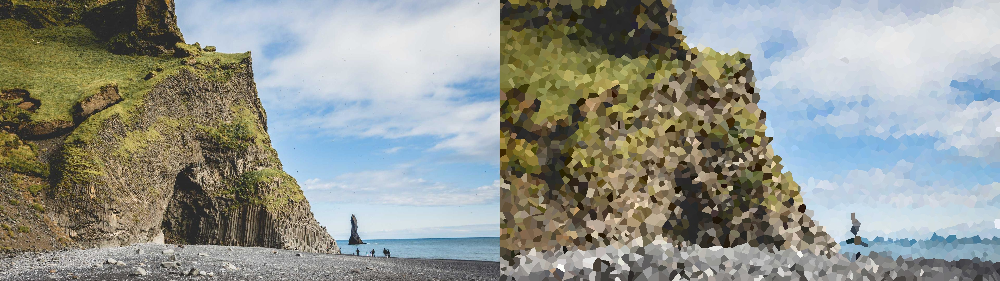
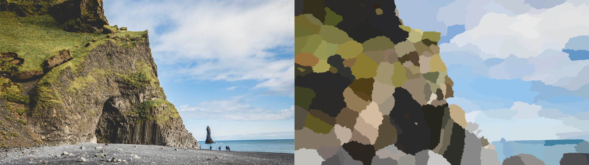
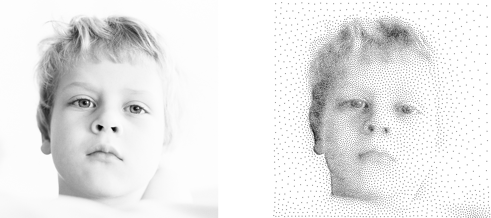
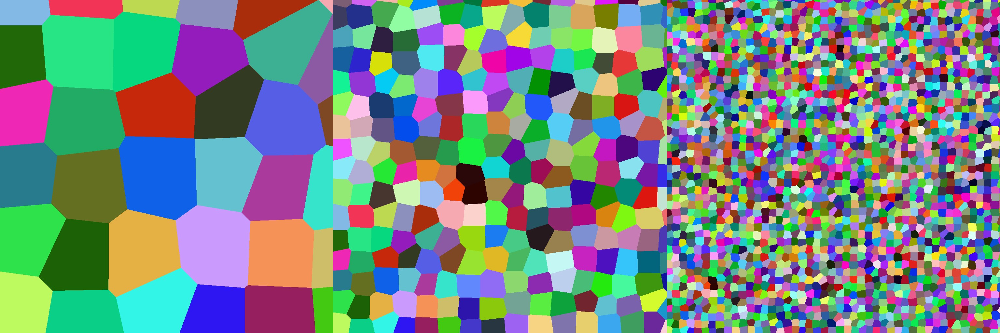

# The Ubiquity of Voronoi Diagrams
This repository contains sample code for experimenting during the workshop "The Ubiquity of Voronoi Diagrams", held at CESCG 2026.

## Building instructions
Please clone the repository recursively to ensure [GLM](https://github.com/g-truc/glm) and [STB](https://github.com/nothings/stb) are properly added as submodules.
```
git clone --recursive https://github.com/filthynobleman/cescg-voronoi.git
```

The building process is carried out with [CMake](https://cmake.org/), so please be sure to have it installed on your system.  
You will also need a working C++ compiler, compliant with the standard [C++17](https://cppreference.com/cpp/17).  
The codebase contains some pieces of code that are parallelized using [OpenMP](https://www.openmp.org/). While not mandatory (the code compiles anyway), installing it is strongly suggested for efficiency.

From the root directory of the project, configure and build everything with CMake
```
mkdir build
cd build
cmake ..
cmake --build . --config release --parallel
```

> :warning: Please note that some files **_require_** CMake configuration. If you make changes (or add) header files, be sure to reconfigure with `cmake ..` before recompiling.

## Demos
The building process should produce a `bin/` folder inside the build directory. The folder contains four executable that implement the main demos shown during the workshop.

Please not that the `samples/` directory contains some sample images that you can use for testing the demos and your code.

### Mosaicking
The application `/bin/Mosaicking[.exe]` applies a mosaicking effect to an image: it computes a Voronoi diagram and colors each texel with the same color as the generating site. The resulting effect looks like this.



The syntax to execute the demo is the following
```
./bin/Mosaicking input_image [OPTIONS]

POSITIONAL ARGUMENTS
input_image                 The path to an image in a format supported by the 
                            STB library. 
                            Images should have either 1 or 3 channels. Other 
                            numbers of channels are not supported.
                            Default: <project_root>/samples/beach-1920x1080.jpg

ARGUMENTS WITH VALUE
-o or --output              Allows specifying an output file where the image 
                            should be saved.
                            Supported formats are JPEG, PNG, and BMP.
                            Default: <build_directory>/output/mosaicking.jpg

-n or --num-sites           Allows specifying the number of sites to be used in
                            the Voronoi diagram.
                            No checks are performed for zero/negative/invalid 
                            values.
                            Default: 5000

FLAGS
-c or --centroidal          If this option is given, the Voronoi diagram is 
                            relaxed to a centroidal tessellation with 20 
                            iterations of LLoyd's algorithm.

-e or --draw-edges          If this option is given, white lines are drawn to 
                            highlight the boundary of the Voronoi cells.
```

### Front propagation
The application `/bin/FrontPropagation[.exe]` also applies a mosaicking effect to an image, but it does so with the front propagation algorithm. It allows interpolating between the Euclidean distance and the difference of colors between adjacent cells, resulting in an effect like the following.



The syntax to execute the demo is the following
```
./bin/FrontPropagation input_image [OPTIONS]

POSITIONAL ARGUMENTS
input_image                 The path to an image in a format supported by the 
                            STB library. 
                            Images should have either 1 or 3 channels. Other 
                            numbers of channels are not supported.
                            Default: <project_root>/samples/beach-1920x1080.jpg

ARGUMENTS WITH VALUE
-o or --output              Allows specifying an output file where the image 
                            should be saved.
                            Supported formats are JPEG, PNG, and BMP.
                            Default: <build_directory>/output/frontprop.jpg

-n or --num-sites           Allows specifying the number of sites to be used in
                            the Voronoi diagram.
                            No checks are performed for zero/negative/invalid
                            values.
                            Default: 200

-f or --interp-factor       Allows specifying the linear interpolation factor 
                            between the Euclidean distance (-f 0) and the 
                            distance defined by the color difference (-f 1).
                            Values out of range are clamped to the interval 
                            [0, 1], but no checks are performed for other 
                            invalid values.
                            Default: 0
```

### Stippling
The application `/bin/Stippling[.exe]` applies a stippling effect to an image. It samples points with a probability distribution that follows `1 - Luminance`. Points are then repositioned according to a weighted centroidal Voronoi diagram, where the density is defined by `1 - Luminance`. The resulting effect looks like the following.



The syntax to execute the demo is the following
```
./bin/Stippling input_image [OPTIONS]

POSITIONAL ARGUMENTS
input_image                 The path to an image in a format supported by the 
                            STB library. 
                            Images should have either 1 or 3 channels. Other 
                            numbers of channels are not supported.
                            Note that the image is converted to grayscale before
                            being processed.
                            Default: <project_root>/samples/kid-1024x1024.jpg

ARGUMENTS WITH VALUE
-o or --output              Allows specifying an output file where the image 
                            should be saved.
                            Supported formats are JPEG, PNG, and BMP.
                            Default: <build_directory>/output/stippling.jpg

-n or --num-sites           Allows specifying the number of sites to be used in 
                            the Voronoi diagram.
                            No checks are performed for zero/negative/invalid 
                            values.
                            Default: 10000

-s or --point-size          Allows specifying the stipple size in pixels.
                            The size is expressed as the diameter of the 
                            stipple.
                            Default: 2

-t or --threshold           Allows specifying the threshold above which 
                            luminance should be considered to high for sampling.
                            Namely, if a pixel's luminance exceeds the 
                            threshold, a sample cannot be placed there.
                            Default: 1

FLAGS
-i or --inverse             If this option is given, the luminance of the iamge 
                            is inverted before processing.
```


### Voronoi texture
The application `/bin/Texture[.exe]` generates a procedural Voronoi texture with random colors. It is possible to specify the scale of the texture to achieve patterns with different granularity. Here are depicted Voronoi textures at scales 5, 15, and 45.



The syntax to execute the demo is the following
```
./bin/Texture output_image [OPTIONS]

POSITIONAL ARGUMENTS
output_image                Path to the output file where the image should be 
                            saved.
                            Supported formats are JPEG, PNG, and BMP.
                            Default: <build_directory>/output/texture.jpg

ARGUMENTS WITH VALUE
-s or --scale               The image is considered to represent the square 
                            [0, 1], so this argument allows specifying how much 
                            the image should be scaled.
                            Namely, it sets the image to represent the square 
                            [0, Scale].
                            Default: 5.0

-d or --dimension           Allows specifying the image size (namely, the 
                            resolution). The produced image will always be a 
                            square with the given size.
                            Default: 1024

-r or --randomness          Allows specifying the randomness factor in the 
                            sites' positions. It interpolates from the standard 
                            square grid (-r 0) to the completely random 
                            positioning of the sites (-r 1).
                            Default: 1.0
```